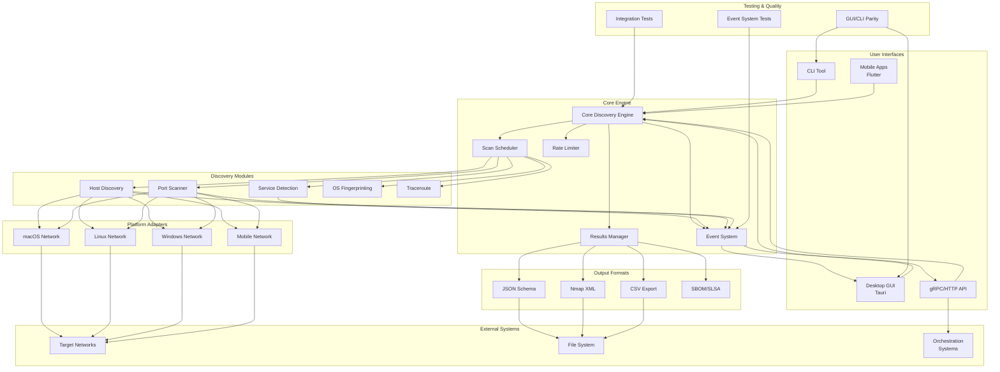

# cyNetMapper Architecture

## Overview

cyNetMapper is a cross-platform network discovery and mapping tool designed to match nmap's host/port/service/OS detection capabilities while maintaining security compliance and ethical usage standards.

## Design Principles

- **Security First**: Default to safe modes, require explicit authorization, respect platform constraints
- **Cross-Platform**: Single Rust codebase with platform-specific adapters
- **Performance**: Async/await with adaptive timing and rate limiting
- **Compatibility**: Nmap-compatible output formats and semantics
- **Modularity**: Clean separation between discovery engine, platform adapters, and UIs

## Architecture Overview



## Component Details

### Core Discovery Engine

**Responsibilities:**
- Coordinate discovery operations
- Manage scan state and progress
- Handle error recovery and retries
- Enforce security policies

**Key Features:**
- Async/await architecture using Tokio
- Configurable scan profiles (Safe, Balanced, Fast)
- Resumable scans with checkpoint files
- Authorization checks and consent validation

### Discovery Modules

#### Host Discovery
- **ARP Sweep**: IPv4 local network discovery
- **ICMP Probes**: Echo, Timestamp, Address Mask
- **TCP Probes**: SYN/ACK to common ports
- **UDP Probes**: DNS, DHCP, SNMP
- **IPv6 NDP**: Neighbor Discovery Protocol
- **mDNS/Bonjour**: Service discovery

#### Port Scanner
- **TCP Connect**: Cross-platform, no privileges required
- **TCP SYN**: Raw sockets where available
- **UDP Scan**: Service-specific payloads
- **SCTP INIT**: Stream Control Transmission Protocol
- **Port States**: open, closed, filtered, unfiltered, open|filtered, closed|filtered

#### Service Detection
- **Banner Grabbing**: Protocol-specific probes
- **TLS Analysis**: SNI, ALPN, certificate inspection
- **HTTP Detection**: Headers, server identification
- **Protocol Fingerprinting**: SSH, FTP, SMTP, etc.

#### OS Fingerprinting
- **Passive Analysis**: TTL, window size, TCP options
- **Active Probes**: ICMP responses, TCP behavior
- **Confidence Scoring**: Statistical analysis

### Event System

**Real-time Event Architecture:**
- Structured event emission during scanning operations
- Thread-safe event broadcasting with async/await
- GUI integration through Tauri event bridge
- Comprehensive logging with tracing integration

**Event Types:**
- **ScanStarted**: Scan initiation with metadata
- **HostDiscovered**: Real-time host discovery notifications
- **PortDiscovered**: Live port status updates with service info
- **ScanProgress**: Periodic progress metrics and ETA
- **ScanCompleted**: Final results with performance data
- **Error**: Detailed error events with context

**Event Flow:**
```
Core Engine → Event Emitter → GUI Bridge → Frontend Store → UI Updates
     ↓              ↓              ↓              ↓              ↓
Structured    Thread-safe     Tauri Events   State Mgmt   Real-time UI
 Logging      Broadcasting                                        
```

**Performance Considerations:**
- Event throttling to prevent UI flooding
- Efficient serialization (JSON/bincode)
- Memory-conscious event cleanup
- Async event processing

### Integration Testing

**Test Architecture:**
- Comprehensive GUI/CLI parity verification
- Event system functionality testing
- Concurrent scan handling validation
- Error recovery and resilience testing

**Test Categories:**
- **Core Scanner Tests**: Basic functionality verification
- **Result Consistency**: GUI vs CLI output comparison
- **Concurrent Operations**: Multi-scan coordination
- **Error Handling**: Failure scenarios and recovery
- **Port Range Validation**: Different scanning configurations

**Test Infrastructure:**
- Dedicated `tests/` workspace member
- Docker lab environment integration
- Automated CI/CD test execution
- Performance benchmarking

### Platform Adapters

#### macOS Network Adapter
- Raw socket support with privileges
- Network framework integration
- Keychain integration for certificates
- App Store compliance

#### Linux Network Adapter
- Netlink socket integration
- CAP_NET_RAW capability handling
- Container-aware networking
- Distribution packaging

#### Windows Network Adapter
- WinSock2 integration
- UAC privilege escalation
- Windows Defender compatibility
- MSI packaging

#### Mobile Network Adapter
- **Android**: VPN service, NDK integration
- **iOS**: Limited to Connect scans, mDNS
- Foreground service notifications
- Battery optimization

### Output Formats

#### JSON Schema (Canonical)
```json
{
  "version": "1.0",
  "scan_info": {
    "start_time": "2024-01-15T10:30:00Z",
    "end_time": "2024-01-15T10:35:00Z",
    "tool_version": "1.0.0",
    "command_line": "cynetmapper scan --target 192.168.1.0/24",
    "profile": "balanced"
  },
  "hosts": [
    {
      "address": "192.168.1.1",
      "hostnames": ["router.local"],
      "state": "up",
      "ports": [
        {
          "port": 80,
          "protocol": "tcp",
          "state": "open",
          "service": {
            "name": "http",
            "version": "nginx/1.20.1",
            "banner": "Server: nginx/1.20.1"
          }
        }
      ],
      "os": {
        "name": "Linux",
        "version": "5.4",
        "confidence": 85
      }
    }
  ]
}
```

#### Nmap XML Compatibility
- Subset of nmap XML schema
- Compatible with existing parsers
- Maintains semantic equivalence

## Security Model

### Threat Model (STRIDE Analysis)

#### Spoofing
- **Threat**: Malicious actors impersonating cyNetMapper
- **Mitigation**: Code signing, SBOM attestation, secure distribution

#### Tampering
- **Threat**: Modification of scan results or tool behavior
- **Mitigation**: Immutable audit logs, result signing, integrity checks

#### Repudiation
- **Threat**: Denial of scan activities
- **Mitigation**: Comprehensive logging, timestamped results, audit trails

#### Information Disclosure
- **Threat**: Unauthorized access to scan results or network information
- **Mitigation**: Encrypted storage, access controls, secure transmission

#### Denial of Service
- **Threat**: Tool causing network disruption or being disrupted
- **Mitigation**: Rate limiting, adaptive timing, graceful degradation

#### Elevation of Privilege
- **Threat**: Unauthorized privilege escalation
- **Mitigation**: Principle of least privilege, capability-based security

### Security Controls

1. **Authorization Checks**
   - Pre-scan consent validation
   - Network ownership verification
   - Legal compliance warnings

2. **Safe Defaults**
   - Conservative scan rates
   - No stealth or evasion techniques
   - Explicit privilege requests

3. **Audit Trail**
   - Immutable scan logs
   - Hash chain verification
   - Optional result signing

4. **Platform Compliance**
   - iOS App Store policy adherence
   - Android security model compliance
   - Enterprise deployment support

## Performance Characteristics

### Timing Profiles

- **Safe**: 1 probe/sec, 10 concurrent targets
- **Balanced**: 10 probes/sec, 50 concurrent targets
- **Fast**: 100 probes/sec, 200 concurrent targets

### Adaptive Timing
- Packet loss monitoring
- RTT-based backoff
- Congestion detection
- Per-target rate adjustment

### Resource Management
- Memory-mapped result storage
- Streaming JSON output
- Configurable buffer sizes
- Battery-aware mobile operation

## Deployment Architecture

### Desktop Applications
- **macOS**: Universal binary, notarized, Homebrew
- **Linux**: AppImage, Deb/RPM packages, static MUSL
- **Windows**: MSI installer, winget package

### Mobile Applications
- **Android**: AAB/APK with native libraries
- **iOS**: XCFramework, TestFlight distribution

### Container Deployment
- Docker images for CI/CD
- Kubernetes operator for orchestration
- Helm charts for deployment

### API Service
- gRPC/HTTP endpoints
- Authentication tokens
- CORS configuration
- Rate limiting

## Development Workflow

### Build System
- Cargo workspace with multiple crates
- Cross-compilation targets
- Reproducible builds
- SBOM generation

### Testing Strategy
- Unit tests for core logic
- Integration tests with Docker lab
- Golden output comparison
- Performance benchmarks

### CI/CD Pipeline
- GitHub Actions
- Multi-platform builds
- Security scanning
- Automated releases

## Future Considerations

### Extensibility
- Plugin architecture for custom probes
- Scripting interface (safe subset)
- Custom output formats

### Scalability
- Distributed scanning
- Result aggregation
- Cloud deployment

### Integration
- SIEM connectors
- Vulnerability scanners
- Asset management systems

This architecture provides a solid foundation for implementing cyNetMapper while maintaining security, performance, and cross-platform compatibility requirements.